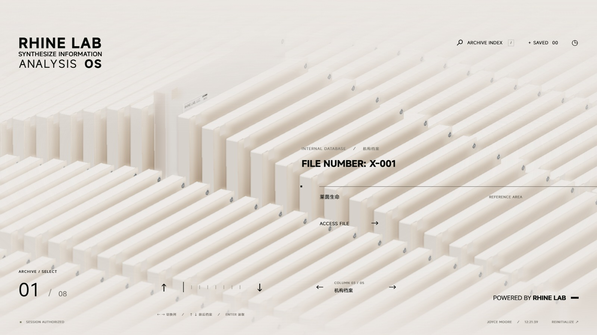

# Rhine Speech Archive · 莱茵语音工作台

莱茵语音工作台是一个运行在 Windows 本机的中文语音识别工作台。它将实时听写、文件转写、目标说话人过滤、多人会议转写和声纹注册管理放入一套《明日方舟》莱茵生命风格的三维档案终端，让语音任务可以通过可交互的档案界面完成。



## 功能总览

| 档案 | 功能 | 引擎 / 模型 | 适用输入 |
| --- | --- | --- | --- |
| X-001 | 非实时普通识别 | SenseVoice Small（ONNX INT8 / CPU） | 麦克风、电脑音频、WAV |
| X-002 | 非实时普通识别 | Fun-ASR-Nano（PyTorch / GPU 优先） | 麦克风、电脑音频、WAV |
| X-003 | 非实时普通识别 | Qwen3-ASR 1.7B（多语言，显存要求较高） | 麦克风、电脑音频、WAV |
| X-005 | 实时普通识别 | SenseVoice Small（约 0.8 秒分块重识别） | 麦克风、电脑音频、WAV |
| X-006 | 实时普通识别 | Fun-ASR-Nano（VAD 分段，预览可修订） | 麦克风、电脑音频、WAV |
| X-007 | 实时目标说话人识别 | FSMN-VAD + CAM++ + SenseVoice | 麦克风、电脑音频、WAV |
| X-008 | 多人会议转写 | MOSS-Transcribe-Diarize（说话人分离 + 时间戳） | 麦克风、电脑音频、WAV |
| X-009 | 声纹注册、查看与删除 | CAM++ 声纹特征 | 麦克风、电脑音频、WAV |
| X-010 | 实时普通识别（准实时） | 样品-X Sample-X v3.2.1 · MNN / 可选 CUDA | 浏览器麦克风、屏幕共享、WAV 重放 |

输入能力说明：

- **麦克风**：使用 Windows 默认输入设备。
- **电脑音频**：通过 WASAPI 回环采集系统默认播放设备，无需开启“立体声混音”。
- **WAV 文件**：单文件最长 10 分钟、最大 64 MB（样品-X 档案为 100 MB），自动重采样为 16 kHz 单声道。
- **实时采集上限**：麦克风 / 电脑音频单次最多 120 秒；声纹注册最多 30 秒。

识别结果支持复制、导出 TXT；会议档案额外支持 JSON 与 SRT 导出，并保留分段说话人与时间戳。

## 快速开始

### 环境要求

- Windows 10/11
- Python 3.10+，建议 3.11
- Chrome / Edge 等支持 WebGL 2 的现代浏览器
- NVIDIA GPU 为可选项；不可用时多数模型会回退 CPU
- Node.js 22.12+ 仅在重新构建前端时需要

### 启动步骤

1. 克隆或下载本仓库。
2. 双击 `初始化莱茵语音工作台.cmd`，完成虚拟环境、核心依赖和核心模型准备。
3. 双击 `启动莱茵语音工作台.cmd`。
4. 浏览器会自动打开 <http://127.0.0.1:8765/rhine/>。

首次进入会播放入场动画，按 `Enter` / `Esc` 或点击 `ENTER SYSTEM` 可以跳过。初始化脚本也可以在 PowerShell 中执行：

```powershell
powershell -ExecutionPolicy Bypass -File .\setup-workbench.ps1
```

可选模型、GPU 环境、每个档案的操作步骤和常见问题见 [使用说明](docs/USAGE.md)。

## 目录结构

```text
.
├─ 初始化莱茵语音工作台.cmd # 一键初始化入口
├─ 启动莱茵语音工作台.cmd   # 一键启动入口
├─ setup-workbench.ps1      # 初始化脚本
├─ RhineLabUI/              # 三维档案前端
│  ├─ src/                  # TypeScript 源码
│  ├─ dist/                 # 前端构建产物，克隆后可直接运行
│  └─ .tools/               # 启动与停止脚本
├─ latest_stage/            # Python 识别后端
│  ├─ src/web/              # HTTP 服务与任务调度
│  ├─ src/models/           # 识别模型适配层
│  ├─ src/pipeline/         # 实时、非实时与目标说话人流水线
│  ├─ scripts/              # 环境与模型准备脚本
│  └─ tests/                # 后端测试
└─ sample-x/                # 样品-X 可选推理服务
   ├─ runtime/              # MNN 推理代码与本地模型资产目录
   ├─ server.py             # 识别服务入口
   └─ pipeline.py           # 分段、VAD 与调度实现
```

## 技术栈

- **前端**：TypeScript、Three.js、Vite；界面与三维模型来自 [RhineLabUI](https://github.com/LBEILC/RhineLabUI)。
- **后端**：Python 标准库 `http.server`、NumPy、FunASR、ONNX Runtime、ModelScope、soundfile、soxr、PyAudioWPatch。
- **模型**：SenseVoice Small、Fun-ASR-Nano、Qwen3-ASR 1.7B、FSMN-VAD、CAM++、MOSS-Transcribe-Diarize、Silero VAD、样品-X Sample-X。
- **推理设备**：优先 CUDA，不可用时自动回退 CPU；SenseVoice ONNX INT8 与声纹组件使用 CPU。

## 隐私边界

- 本项目定位为个人本机工具，请只处理你有权采集和识别的音频。
- 录音、识别文本和声纹特征属于敏感数据；导出或保留这些数据时，请自行设置访问权限并妥善保管。
- 目标说话人功能是**声纹验证**，不是声源分离，也不可用于身份认证；重叠讲话、相似声音与噪声仍可能误收或漏字。
- 会议转写中的 S01/S02 等编号只在单次录音内有效，不能跨录音对应到同一个人。

## 版权与致谢

- 本仓库自有代码采用 MIT 许可证。
- 三维终端、配乐与界面基于 [RhineLabUI](https://github.com/LBEILC/RhineLabUI)；《明日方舟》及“莱茵生命”相关名称与美术元素版权归上海鹰角网络科技有限公司所有，本项目为非官方同人作品，不得用于商业用途。
- 识别模型、开源库、字体与素材的来源及许可证见 [docs/OPEN-SOURCE.md](docs/OPEN-SOURCE.md)，使用时请遵循对应上游协议。
